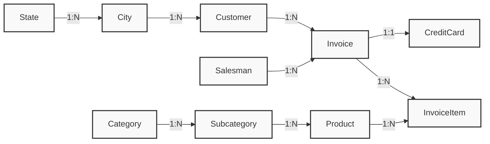

# 01 – Relational Database Basics

Before writing any SQL, you need a mental model of what you are querying.

## Learning objectives

After this file, you should be able to:

- explain what SQL is, and name its main sublanguages;
- explain what a table, row, and column are;
- explain what a primary key is and why every table needs one;
- explain what a foreign key is and how it creates a relationship between two tables;
- distinguish a one-to-many relationship from a many-to-many relationship;
- read the schema of `AdventureWorksENG`, the database used in the rest of this material.

------------------------------------------------------------------------

## Section 1 – What is SQL?

**SQL** (Structured Query Language) is the language used to work with a
relational database.

SQL is used for:

- defining the structure of a database (which tables exist, and their columns and rules);
- retrieving data;
- inserting, changing, and deleting data;
- defining constraints and rules over the data.

These jobs are grouped into a few named sublanguages. You'll see these
terms used constantly once you start reading SQL documentation or talking
to other developers, so it's worth knowing them from the start:

| Sublanguage | Stands for | Typical commands | Covered in |
|---|---|---|---|
| **DDL** | Data Definition Language | `CREATE`, `ALTER`, `DROP` | [08 – Database Integrity & Constraints](08-database-integrity-and-constraints.md) |
| **DML** | Data Manipulation Language | `SELECT`, `INSERT`, `UPDATE`, `DELETE` | [02](02-select-basics.md)–[07](07-insert-update-delete.md) |
| **TCL** | Transaction Control Language | `BEGIN TRAN`, `COMMIT`, `ROLLBACK` | briefly in [07 – INSERT, UPDATE, DELETE](07-insert-update-delete.md) |
| **DCL** | Data Control Language | `GRANT`, `REVOKE` | out of scope for this material |

Most of what you'll write day to day is DML — querying and changing data.
DDL comes up whenever you design or modify a table's structure. TCL
appears whenever you want to try a change safely before committing to it.
DCL (permissions — who is allowed to do what) isn't covered here; it
belongs to database administration rather than day-to-day querying.

### Check your understanding

1. Which sublanguage would `CREATE TABLE` belong to?
2. Which sublanguage would `UPDATE ... SET ...` belong to?
3. Which sublanguage manages permissions, and is it covered in this material?

<details>
<summary>Show answers</summary>

1. DDL (Data Definition Language) — it defines a table's structure.
2. DML (Data Manipulation Language) — it changes data inside a table.
3. DCL (Data Control Language); no, it's out of scope here.

</details>

------------------------------------------------------------------------

## Section 2 – Tables, rows, and columns

A relational database stores data in **tables**.

A table looks like a spreadsheet:

- each **column** has a name and a data type (text, number, date, ...);
- each **row** is one record — one product, one customer, one invoice.

```text
Product
+------------+----------------+----------+----------------+
| IDProduct  | Name           | Color    | PriceWithoutVAT|
+------------+----------------+----------+----------------+
| 1          | Mountain Bike  | Black    | 1200.00        |
| 2          | Road Helmet    | Red      | 45.00          |
| 3          | Water Bottle   | NULL     | 8.50            |
+------------+----------------+----------+----------------+
```

A database is simply a collection of such tables, plus the rules that
connect them.

### Check your understanding

1. What is a row in a table also sometimes called?
2. What two things does a column definition need?

<details>
<summary>Show answers</summary>

1. A record, or an entry.
2. A name and a data type.

</details>

------------------------------------------------------------------------

## Section 3 – Primary keys

Every table needs a way to uniquely identify each row. That is the job of
the **primary key (PK)**.

In the `Product` table above, `IDProduct` is the primary key:

- every row has a value;
- no two rows share the same value;
- the value never changes once a row is created.

Primary keys are usually a single integer column that SQL Server
auto-generates (an **identity** column), so you never have to invent an ID
yourself when inserting a row.

> **Why it matters:** once a row has a stable, unique ID, other tables can
> refer to it safely — even if its name or other details change later.

### Check your understanding

1. Could two rows in the same table share the same primary key value?
2. Why is a customer's email address usually a poor choice for a primary key, even though it is also unique?

<details>
<summary>Show answers</summary>

1. No — that is exactly what a primary key forbids.
2. It can change (a customer updates their email), and primary keys are
    meant to stay constant for the life of the row.

</details>

------------------------------------------------------------------------

## Section 4 – Foreign keys and relationships

Real data rarely fits in one table. A retailer needs products, customers,
and invoices — and invoices need to say *which* customer and *which*
products were involved.

A **foreign key (FK)** is a column in one table that stores the primary
key value of a row in another table, creating a link between them.

```text
Customer                          Invoice
+------------+----------+         +------------+-------------+
| IDCustomer | Name     |         | IDInvoice  | CustomerID  |
+------------+----------+         +------------+-------------+
| 1          | Ana Anić |   <---- | 101        | 1           |
| 2          | Bruno... |   <---- | 102        | 1           |
+------------+----------+         +------------+-------------+
```

`Invoice.CustomerID` is a foreign key pointing at `Customer.IDCustomer`.
Both invoices above belong to the same customer, `Ana Anić`.

### One-to-many

This is the most common relationship. **One** customer can have **many**
invoices, but each invoice belongs to exactly **one** customer. You will
see this written as `1:N`.

### Many-to-many, resolved with a junction table

Sometimes two things can each relate to many of the other — for example,
one invoice can contain many products, and one product can appear on many
invoices. A plain foreign key cannot express that directly, so a third
table sits between them, holding one row per combination:

```text
Invoice  1 ---- N  InvoiceItem  N ---- 1  Product
```

`InvoiceItem` is a **junction table**: each row links one invoice to one
product (plus details like quantity and price for that specific line).
This pattern — two foreign keys on a middle table — is how every
many-to-many relationship in a relational database is built.

### Check your understanding

1. In the diagram above, which table is "the many side" of the `Customer`–`Invoice` relationship?
2. Why can't a many-to-many relationship be represented with a single foreign key column?
3. What two foreign keys would you expect to find on `InvoiceItem`?

<details>
<summary>Show answers</summary>

1. `Invoice` — many invoices can belong to one customer.
2. A single foreign key column can only point to one row, but a
    many-to-many relationship needs each side to be able to link to several
    rows on the other side. A junction table with two foreign keys solves
    this by using one row per combination.
3. `InvoiceID` (→ `Invoice`) and `ProductID` (→ `Product`).

</details>

------------------------------------------------------------------------

## Section 5 – The AdventureWorksENG schema

All examples and exercises in this material use `AdventureWorksENG`, a
small sample database for a retailer selling products to customers.



### Naming conventions

- **Primary keys:** `ID<TableName>` — e.g. `Customer.IDCustomer`.
- **Foreign keys:** `<ReferencedTable>ID` — e.g. `Invoice.CustomerID`
    points at `Customer.IDCustomer`.

Once you notice this pattern, you can guess most column names before
looking them up.

### The tables you will use most

| Table | What it holds |
|---|---|
| `Customer` | the people placing orders |
| `Product` | the item catalog |
| `Category` / `Subcategory` | product grouping, two levels deep |
| `Invoice` | one order/bill |
| `InvoiceItem` | one line item on an invoice (links `Invoice` and `Product`) |
| `City` / `State` | customer geography |
| `Salesman` | staff who close a sale |
| `CreditCard` | payment method used on an invoice |

You do not need to memorize every column now — later files introduce the
specific columns you need as they come up.

### Check your understanding

1. Which table links `Invoice` and `Product`?
2. If you wanted to know which state a customer lives in, which two foreign keys would you have to follow?

<details>
<summary>Show answers</summary>

1. `InvoiceItem`.
2. `Customer.CityID` → `City`, then `City.StateID` → `State`.

</details>

------------------------------------------------------------------------

## What you should know after this file

- SQL is organized into sublanguages: **DDL** (structure: `CREATE`/`ALTER`/`DROP`), **DML** (data: `SELECT`/`INSERT`/`UPDATE`/`DELETE`), **TCL** (transactions: `BEGIN TRAN`/`COMMIT`/`ROLLBACK`), and **DCL** (permissions, out of scope here).
- A database is a set of **tables**, each with **rows** and **columns**.
- A **primary key** uniquely identifies each row in a table.
- A **foreign key** is a column that points at a primary key in another table, creating a relationship.
- A **one-to-many** relationship is a single foreign key column.
- A **many-to-many** relationship needs a **junction table** with two foreign keys.
- `AdventureWorksENG` follows a consistent `ID<Table>` / `<Table>ID` naming pattern.

## Where to go next

Continue to [02 – SELECT Basics](02-select-basics.md) to start writing
queries against this schema.
